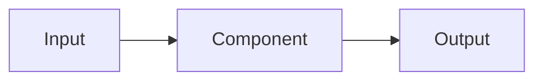

# Backend README Generator

Generate or update folder-level README files for the `backend/` directory based on git changes before a commit.

## Trigger

Invoke this skill when the user wants to:
- Document backend folders before committing
- Create or refresh folder-level READMEs
- Run `/backend-readme` explicitly
- Says things like "update backend docs", "generate folder readmes", "document backend changes"

## Instructions

### Step 1 — Identify Changed Backend Folders

Run the following to find which backend folders have staged or unstaged changes:

```bash
git diff --name-only HEAD
git diff --name-only --cached
git status --short
```

Collect all changed files under `backend/`. Extract unique **first-level** subdirectories (e.g. `backend/agents/foo.py` → `backend/agents`). Exclude `backend/venv` and `backend/__pycache__` entirely.

The tracked backend folders are:
- `backend/agents`
- `backend/api`
- `backend/config`
- `backend/db`
- `backend/rag`
- `backend/utils`
- `backend/` (root — for top-level files like `main.py`, `requirements.txt`)

If there are **no changed files** in backend, inform the user and stop. Do not update any READMEs.

If the user explicitly asks to regenerate all READMEs (e.g. "regenerate all" or "from scratch"), process all tracked folders regardless of git state.

### Step 2 — Read Each Changed Folder

For each changed folder:
1. List all `.py` files in the folder (not subfolders/venv)
2. Read each file — understand its purpose, key functions/classes, and how it fits the agent pipeline
3. Check if a `README.md` already exists in that folder

### Step 3 — Generate or Update the README

For **new READMEs** (no existing file), create one from scratch using the full template below.

For **existing READMEs**, read the current content first, then update only the sections that are affected by the changed files. Preserve existing prose, diagrams, and TODOs that are still valid. Add a `## Changelog` entry at the top of that section noting what changed and why.

---

### README Template

Use this structure for every folder README:

```markdown
# `backend/<folder>/`

> One-line summary of what this folder does in the agent pipeline.

## Overview

2–4 sentences explaining the folder's role, what problem it solves, and where it fits in the overall system.

## Files

| File | Purpose |
|------|---------|
| `foo.py` | What this file does |
| `bar.py` | What this file does |

## Functionality

### <Key Feature or Component>
Explain what it does and how. Include function signatures for the most important public functions.

```python
# Example: key function signature
def do_something(input: str) -> dict:
    ...
```

Repeat for each major feature.

## Design Choices

- **Choice 1**: Why this approach was taken over alternatives
- **Choice 2**: Trade-offs made (e.g. simplicity vs. flexibility)
- **Choice 3**: Constraints that shaped the design (local-only, SQLite, etc.)

## Data Flow / Diagram

Show how data moves through this folder using a Mermaid diagram where relevant.



For simple folders, a plain text description is fine instead.

## TODO

- [ ] Known limitation or planned improvement
- [ ] Anything marked with TODO/FIXME in the source

## Changelog

| Date | Change |
|------|--------|
| YYYY-MM-DD | Initial README |
```

---

### Step 4 — Write the Files

Write each README to its folder: `backend/<folder>/README.md`

After writing, print a summary:
```
Updated READMEs:
  ✓ backend/agents/README.md  (updated)
  ✓ backend/db/README.md      (created)
```

## Constraints

- Only process folders under `backend/` — never touch frontend, root, or other directories
- Never modify source `.py` files
- Do not add emojis unless the user asks
- Keep diagrams simple — Mermaid flowcharts preferred
- TODOs should come from actual `# TODO` / `# FIXME` comments in the code, plus obvious gaps you notice
- Design choices should reflect real decisions visible in the code, not generic advice
