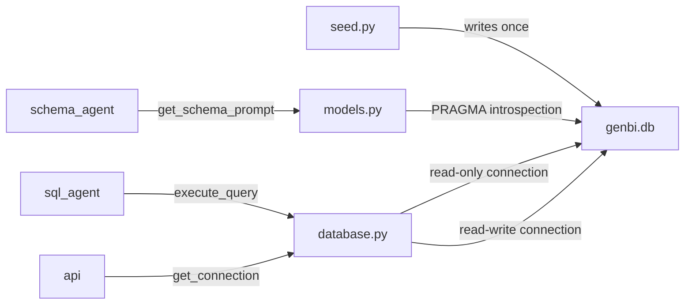

# `backend/db/`

> Database layer — SQLite connection management, schema introspection, and mock data seeding for the FMCG supply chain dataset.

## Overview

This folder owns everything related to the SQLite database: how connections are opened and closed, how the schema is described to the LLM, and how the mock dataset is generated. It is the only folder that touches `sqlite3` directly — all other backend modules go through the public API exported from `__init__.py`.

The database file lives at `data/genbi.db` (resolved relative to this file, so it works from any working directory).

## Files

| File | Purpose |
|------|---------|
| `database.py` | Connection factory — read-write and read-only context managers, `execute_query()` entry point |
| `models.py` | Schema introspection — dataclasses for table/column/FK metadata, prompt-ready schema string |
| `seed.py` | Mock data generator — 12 months of FMCG supply chain data for Indian F&B market (Jan–Dec 2025) |
| `__init__.py` | Re-exports `get_connection`, `get_readonly_connection`, `execute_query`, `get_schema_prompt`, `get_table_names` |

## Functionality

### Connection Management (`database.py`)

Two connection modes, both implemented as context managers:

```python
# Read-write — for chat session and message persistence
with get_connection() as conn:
    conn.execute("INSERT INTO chat_sessions ...")

# Read-only — for SQL Agent query execution
# Opens DB in immutable URI mode; SQLite rejects writes at driver level
with get_readonly_connection() as conn:
    rows = conn.execute("SELECT ...").fetchall()
```

Single query entry point used by the SQL Agent:

```python
def execute_query(sql: str, params: tuple = ()) -> dict[str, Any]:
    # Returns: {"columns": [...], "rows": [[...], ...], "row_count": int}
    # Raises ValueError if query is not SELECT or WITH
```

### Schema Introspection (`models.py`)

Introspects the live SQLite schema at runtime using `PRAGMA table_info` and `PRAGMA foreign_key_list`. Returns a formatted string injected directly into the SQL Agent's system prompt.

```python
def get_schema_prompt() -> str:
    # Returns a DDL-style schema description with all tables, columns,
    # types, constraints, and FK relationships — ready for LLM prompts

def get_table_names() -> list[str]:
    # All user tables, excludes sqlite_* internals

def get_table_schema(table_name: str) -> TableSchema:
    # Single table: columns + foreign keys as dataclasses
```

Schema prompt header example:
```
Database: SQLite — FMCG Supply Chain (Indian F&B, Jan–Dec 2025)
All dates stored as ISO text (YYYY-MM-DD). Monetary values in INR.
```

### Mock Data Seeding (`seed.py`)

Run once to populate the database from scratch:

```bash
python -m backend.db.seed   # from project root
```

Generates realistic FMCG data with:
- **60 products** across 3 categories (Beverages, Snacks, Dairy & Ready-to-eat) from real Indian brands
- **15 distributors**, 40 wholesalers, 150 retailers across 4 zones (North/South/East/West)
- **814 orders** with items and shipments, realistic status distribution (75% Fulfilled)
- **185,125 sales records** with category-aware seasonality (Beverages peak summer, Snacks peak Diwali)
- **31,588 weekly inventory snapshots** per distributor

## Design Choices

- **SQLite over PostgreSQL**: Zero-ops for a local POC. WAL mode gives concurrent readers with a single writer, sufficient for this workload. The abstraction layer makes a future migration straightforward.
- **Read-only connection for SQL Agent**: LLM-generated SQL physically cannot mutate data — enforced at the SQLite driver level via `?mode=ro` URI, not just application logic. Defense in depth.
- **Schema introspected at runtime**: The prompt schema always matches the actual DB state. No risk of drift between hardcoded descriptions and real columns.
- **Absolute DB path**: `DB_PATH` is resolved relative to `database.py` using `__file__`, so the backend works regardless of which directory it's started from.
- **WAL pragma only on read-write connection**: `PRAGMA journal_mode = WAL` is itself a write operation and will error on a read-only connection. Applied only in `get_connection()`.
- **Seeder uses `random.seed(42)`**: Deterministic data generation — re-running seed always produces the same dataset, making debugging reproducible.

## Data Flow



## TODO

- [ ] `seed.py` still uses a hardcoded relative `DB_PATH = pathlib.Path("data/genbi.db")` — should match `database.py` and use `__file__`-relative path
- [ ] `seed.py` hardcoded relative `SCHEMA_PATH` has the same issue
- [ ] No row limit on `execute_query()` — a poorly formed LLM query could return 185K rows; consider adding `LIMIT` guard
- [ ] `get_schema_prompt()` returns the full schema every call; could be cached since schema doesn't change at runtime

## Changelog

| Date | Change |
|------|--------|
| 2026-03-11 | Initial README |
| 2026-03-11 | Fixed hardcoded `DB_PATH` — now resolved relative to `__file__` |
| 2026-03-11 | Fixed `PRAGMA journal_mode = WAL` error on read-only connection |
