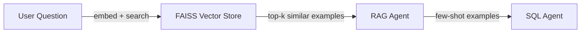

# `backend/rag/`

> Retrieval-Augmented Generation — FAISS vector store and document loader for few-shot SQL example retrieval.

## Overview

This folder implements the RAG layer that retrieves relevant SQL examples for a given user question. The retrieved examples are passed to the SQL Agent as few-shot demonstrations, grounding it in real query patterns rather than generating SQL blind.

The vector store is FAISS, persisted to disk via Docker named volume. The **Operations Center** (separate app) provides a UI for the BI/dev team to curate the example corpus — reviewing agent-generated SQL from chat feedback and saving good/corrected queries as new few-shot examples.

## Files

| File | Purpose |
|------|---------|
| `vector_store.py` | FAISS index management — build, persist, load, and query the vector store |
| `documents.py` | Document definitions — the NL question + SQL pairs used as few-shot examples |
| `__init__.py` | Package init |

## How It Fits the Pipeline



The RAG Agent embeds the incoming question, finds the top-k most similar NL→SQL pairs from the vector store, and passes them as examples in the SQL Agent's prompt.

## Planned Functionality

### `documents.py`
Defines the corpus of NL question + SQLite query pairs. These cover common FMCG supply chain analytics patterns:
- Sales trends by product, brand, region, period
- Inventory levels and low-stock alerts
- Order fulfilment rates by distributor
- Top/bottom performers

### `vector_store.py`
```python
def build_index(documents: list[Document]) -> FAISSIndex
def save_index(index, path: str) -> None
def load_index(path: str) -> FAISSIndex
def search(index, query: str, top_k: int = 3) -> list[Document]
```

## Design Choices

- **FAISS over cloud vector DB**: Lightweight, runs anywhere. FAISS is fast enough for a small corpus of a few hundred examples.
- **RAG as few-shot, not answer path**: Retrieved examples go into the SQL Agent's prompt as demonstrations. The LLM still generates the final SQL — RAG just anchors it to known-good patterns.
- **Curated via Operations Center**: The BI/dev team reviews chat feedback (thumbs up/down), inspects agent-generated SQL, and saves good or corrected queries to the FAISS index. This creates a human-in-the-loop feedback loop that continuously improves NL → SQL accuracy.
- **Static corpus as bootstrap**: The initial example corpus is hand-curated for FMCG supply chain queries. Over time, curated examples from real chat sessions grow the corpus organically.

## TODO

- [ ] Both files are currently empty scaffolds — implementation pending
- [ ] Decide on embedding model — needs to work with the configured LLM endpoint (sentence-transformers, nomic-embed, or Ollama embeddings)
- [ ] Define the initial example corpus in `documents.py` — aim for 20–50 diverse NL/SQL pairs covering the key analytics use cases
- [ ] FAISS index persistence path should come from `settings.py`
- [ ] Ops-backend needs read/write access to the FAISS index for RAG curation

## Changelog

| Date | Change |
|------|--------|
| 2026-03-15 | Updated for Operations Center curation workflow, removed "local-only" language |
| 2026-03-11 | Initial README — scaffolded, implementation pending |
