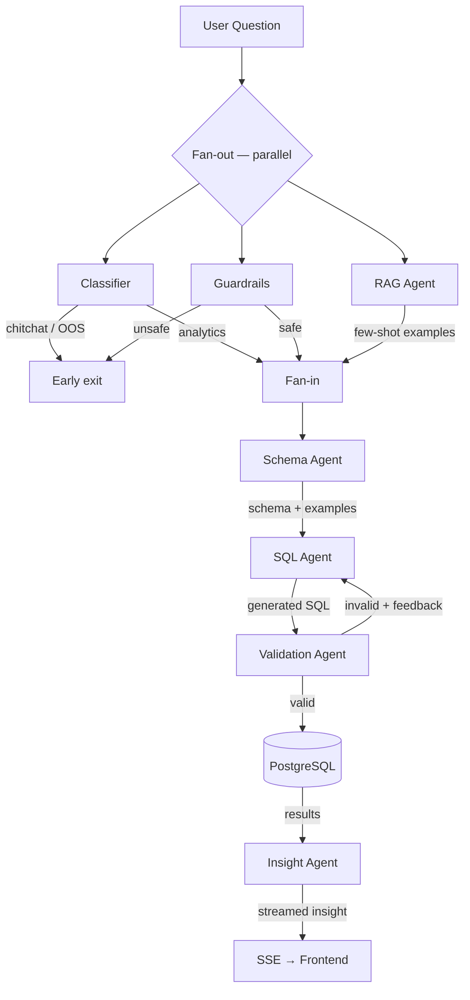

# `portal/backend/agents/`

> Agent modules — the LLM-powered nodes that form the NL → SQL → Insight pipeline, orchestrated by LangGraph.

## Overview

This folder contains every agent in the pipeline. Each agent is a focused module with a single responsibility. They are composed into a LangGraph workflow defined in `portal/backend/graph/pipeline.py`, which handles orchestration, parallel fan-out, and the validation retry loop.

## Files

| File | Purpose |
|------|---------|
| `classifier.py` | Classifies incoming questions as analytics, chitchat, or out-of-scope |
| `guardrails.py` | Safety and SQL injection checks — runs in parallel with classifier and RAG |
| `rag_agent.py` | Retrieves few-shot SQL examples from the pgvector store |
| `schema_agent.py` | Fetches the live DB schema and formats it for the SQL Agent's system prompt |
| `sql_agent.py` | Generates PostgreSQL SQL from the question, schema, and few-shot examples |
| `validation_agent.py` | Checks generated SQL for correctness and safety; provides feedback for retries |
| `insight_agent.py` | Converts query results into a plain-English business insight |
| `__init__.py` | Package init |

## Agent Pipeline (LangGraph)

- **Parallel fan-out**: Classifier, Guardrails, and RAG Agent run concurrently — no reason to wait for one before starting the others.
- **Fan-in**: Results merge before Schema Agent. If guardrails fail or classifier rejects, the pipeline exits early.
- **Validation retry loop**: SQL Agent retries up to 2 times when Validation Agent returns an error, passing the error message back as context.

## Design Choices

- **LangGraph orchestration** — graph-based workflow with native support for parallel branches, conditional edges, and checkpointing. Defined in `portal/backend/graph/pipeline.py`.
- **RAG output feeds SQL Agent as few-shot examples** — not used as a standalone answer path. This grounds the LLM in real query patterns rather than generating SQL blind.
- **Validation Agent provides feedback, never blocks** — it returns structured feedback that the SQL Agent uses on retry. Max 2 retries to prevent infinite loops.
- **Each agent is stateless** — agents receive all context they need as function arguments. No shared mutable state between pipeline steps.
- **Model-agnostic** — all agents call the LLM endpoint configured in `portal/backend/config/settings.py`. Works with Ollama, LM Studio, or any OpenAI-compatible API.

## TODO

- [ ] All agent files are currently empty scaffolds — implementation pending
- [ ] `guardrails.py` does not exist yet — needs to be created
- [ ] Classifier needs label definitions: what counts as "analytics" vs out-of-scope for FMCG supply chain
- [ ] SQL Agent retry limit (2) should come from `settings.py`, not be hardcoded
- [ ] Validation Agent should check for SQL injection patterns in addition to syntax errors
- [ ] Consider adding a timeout per agent to prevent hung LLM calls blocking the SSE stream

## Changelog

| Date | Change |
|------|--------|
| 2026-03-15 | Updated for LangGraph orchestration, parallel fan-out, guardrails agent |
| 2026-03-11 | Initial README — scaffolded, implementation pending |
