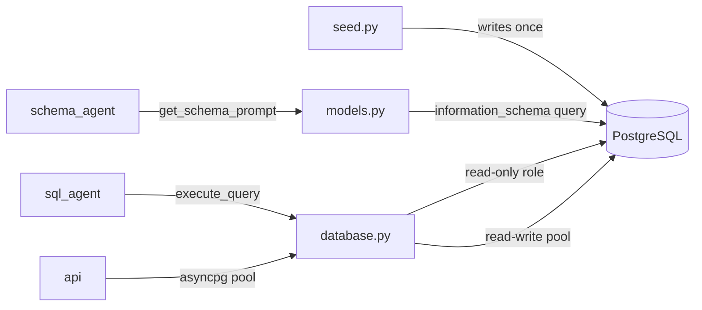

# `portal/backend/db/`

> Database layer — PostgreSQL connection management (asyncpg), schema introspection, and mock data seeding for the FMCG supply chain dataset.

## Overview

This folder owns everything related to the **PostgreSQL FMCG business database**: how connections are opened and closed, how the schema is described to the LLM, and how the mock dataset is generated. It is the only folder that touches `asyncpg` directly — all other backend modules go through the public API exported from `__init__.py`.

Chat history and session data are stored in **MongoDB** (see `portal/backend/api/`), not in PostgreSQL. This folder is exclusively for the FMCG supply chain data that the SQL Agent queries.

The database is accessed via the `POSTGRES_DSN` environment variable. In Docker, the PostgreSQL container is the authoritative data store; the `data/` directory is no longer needed for the FMCG database.

## Files

| File | Purpose |
|------|---------|
| `database.py` | Connection factory — asyncpg pool management, `execute_query()` entry point (read-only role) |
| `models.py` | Schema introspection — dataclasses for table/column/FK metadata, prompt-ready schema string |
| `seed.py` | Mock data generator — 12 months of FMCG supply chain data for Indian F&B market (Jan–Dec 2025) |
| `__init__.py` | Re-exports `get_pool`, `execute_query`, `get_schema_prompt`, `get_table_names` |

## Functionality

### Connection Management (`database.py`)

An asyncpg connection pool is initialised at app startup and shared across requests. SQL Agent queries are executed via a dedicated read-only PostgreSQL role:

```python
# Pool initialisation (called in FastAPI lifespan)
await init_pool(dsn: str) -> None

# Read-only query execution used by the SQL Agent
async def execute_query(sql: str, params: tuple = ()) -> dict[str, Any]:
    # Returns: {"columns": [...], "rows": [[...], ...], "row_count": int}
    # Raises ValueError if query is not SELECT or WITH
```

### Schema Introspection (`models.py`)

Introspects the live PostgreSQL schema at runtime using `information_schema` queries. Returns a formatted string injected directly into the SQL Agent's system prompt.

```python
async def get_schema_prompt() -> str:
    # Returns a DDL-style schema description with all tables, columns,
    # types, constraints, and FK relationships — ready for LLM prompts

async def get_table_names() -> list[str]:
    # All user tables in the public schema

async def get_table_schema(table_name: str) -> TableSchema:
    # Single table: columns + foreign keys as dataclasses
```

Schema prompt header example:
```
Database: PostgreSQL — FMCG Supply Chain (Indian F&B, Jan–Dec 2025)
All dates stored as DATE. Monetary values in INR (NUMERIC).
```

### Mock Data Seeding (`seed.py`)

Run once to populate the database from scratch:

```bash
python -m portal.backend.db.seed   # from project root
```

Generates realistic FMCG data with:
- **60 products** across 3 categories (Beverages, Snacks, Dairy & Ready-to-eat) from real Indian brands
- **15 distributors**, 40 wholesalers, 150 retailers across 4 zones (North/South/East/West)
- **814 orders** with items and shipments, realistic status distribution (75% Fulfilled)
- **185,125 sales records** with category-aware seasonality (Beverages peak summer, Snacks peak Diwali)
- **31,588 weekly inventory snapshots** per distributor

## Design Choices

- **PostgreSQL for FMCG data**: Replaces SQLite; provides native async support via asyncpg, robust concurrent access, and hosts the pgvector extension for RAG in the same instance. Chat/session data goes to MongoDB instead.
- **Read-only PostgreSQL role for SQL Agent**: LLM-generated SQL physically cannot mutate data — enforced at the database role level, not just application logic. Defense in depth.
- **Schema introspected at runtime**: The prompt schema always matches the actual DB state via `information_schema`. No risk of drift between hardcoded descriptions and real columns.
- **asyncpg connection pool**: A shared pool is initialised at app startup and reused across requests, avoiding per-request connection overhead.
- **Seeder uses `random.seed(42)`**: Deterministic data generation — re-running seed always produces the same dataset, making debugging reproducible.

## Data Flow



## TODO

- [ ] `seed.py` should read `POSTGRES_DSN` from environment rather than using a hardcoded default
- [ ] No row limit on `execute_query()` — a poorly formed LLM query could return 185K rows; consider adding `LIMIT` guard
- [ ] `get_schema_prompt()` returns the full schema every call; could be cached since schema doesn't change at runtime
- [ ] Migrations should be managed via a tool (e.g. Alembic) rather than raw SQL files

## Changelog

| Date | Change |
|------|--------|
| 2026-03-15 | Migrated from SQLite to PostgreSQL (asyncpg); updated introspection, design choices, and data flow |
| 2026-03-15 | Clarified PostgreSQL is FMCG-only; chat history in MongoDB |
