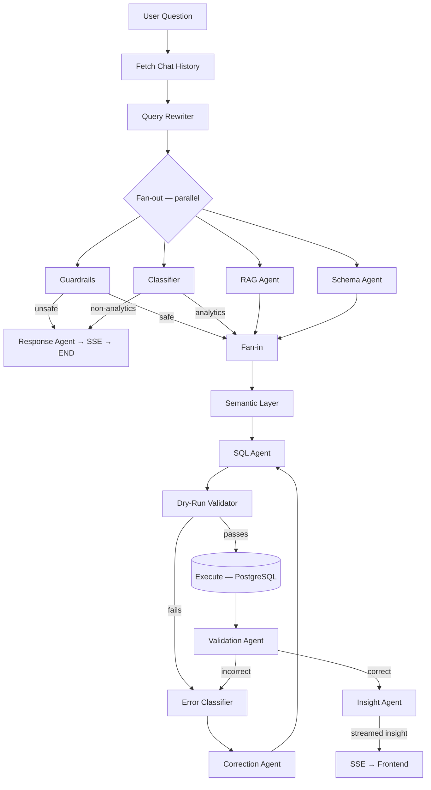

# `user_portal/backend/agents/`

> Agent modules — the LLM-powered nodes that form the NL → SQL → Insight pipeline, orchestrated by LangGraph.

## Overview

This folder contains every agent in the pipeline. Each agent is a focused module with a single responsibility. They are composed into a LangGraph workflow defined in `user_portal/backend/graph/pipeline.py`, which handles orchestration, parallel fan-out, and the validation retry loop.

## Files

| File | Purpose |
|------|---------|
| `rewrite_agent.py` | Resolves follow-up references into a standalone query using chat history; skips if no history |
| `guardrails.py` | LLM-based safety check — prompt injection, SQL injection, system prompt extraction |
| `classifier.py` | Intent routing (analytics / chitchat / history / ambiguous) + disambiguation |
| `response_agent.py` | Handles all non-analytics intents: blocked, ambiguous, chitchat, history |
| `rag_agent.py` | Retrieves few-shot NL→SQL examples from pgvector by cosine similarity |
| `schema_agent.py` | Selects relevant tables; appends value samples so SQL Agent sees exact entity names |
| `sql_agent.py` | SQL generation with Decomposer sub-agent + adapt/single/multi strategies; injects today's date |
| `validation_agent.py` | Dry-run validator, Error Classifier, Correction Agent, Validation Agent (agentic logic check) |
| `insight_agent.py` | Converts query results into a plain-English business insight |
| `__init__.py` | Package init |

## Agent Pipeline (LangGraph)

- **Parallel fan-out**: Guardrails, Classifier, RAG, and Schema Agent all run concurrently after the Query Rewriter.
- **Query Rewriter**: Runs before fan-out to resolve pronouns and follow-up references; skips the LLM call when there is no prior chat history.
- **Fan-in**: Results merge before Semantic Layer. Guardrail failures and non-analytics intents exit via Response Agent.
- **Validation Agent**: Agentic tool-calling loop (max 3 rounds) — checks dates, column values, join paths, and can run test queries before giving a verdict. Falls back to single-shot for providers without function calling.
- **Self-repair loop**: SQL Agent retries up to 3 times when Dry-Run or Validation Agent returns an error.

## Design Choices

- **LangGraph orchestration** — graph-based workflow with native support for parallel branches, conditional edges, and checkpointing. Defined in `user_portal/backend/graph/pipeline.py`.
- **RAG output feeds SQL Agent as few-shot examples** — not used as a standalone answer path. This grounds the LLM in real query patterns rather than generating SQL blind.
- **Validation Agent provides feedback, never blocks** — it returns structured feedback that the SQL Agent uses on retry. Max 2 retries to prevent infinite loops.
- **Each agent is stateless** — agents receive all context they need as function arguments. No shared mutable state between pipeline steps.
- **Model-agnostic** — all agents call the LLM endpoint configured in `user_portal/backend/config/settings.py`. Works with any OpenAI-compatible API (cloud or self-hosted).

## Changelog

| Date | Change |
|------|--------|
| 2026-04-04 | Add Query Rewriter; upgrade Logic Check → Validation Agent (agentic tool loop); Schema Agent appends value samples; SQL Agent injects today's date |
| 2026-03-27 | v2.1 refinements: Response Agent, Correction Agent tools, chat history integration |
| 2026-03-25 | v2 pipeline: all agents implemented; semantic layer, schema linker, self-repair loop |
| 2026-03-15 | Initial README — scaffolded |
